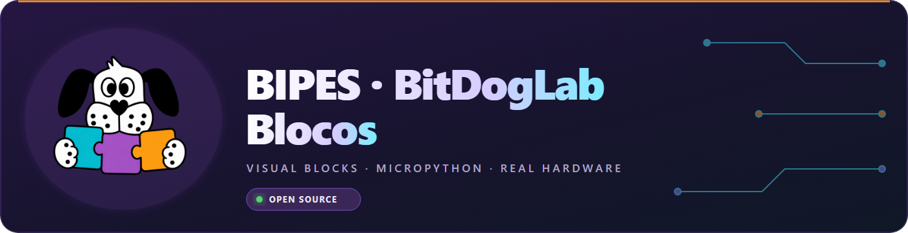
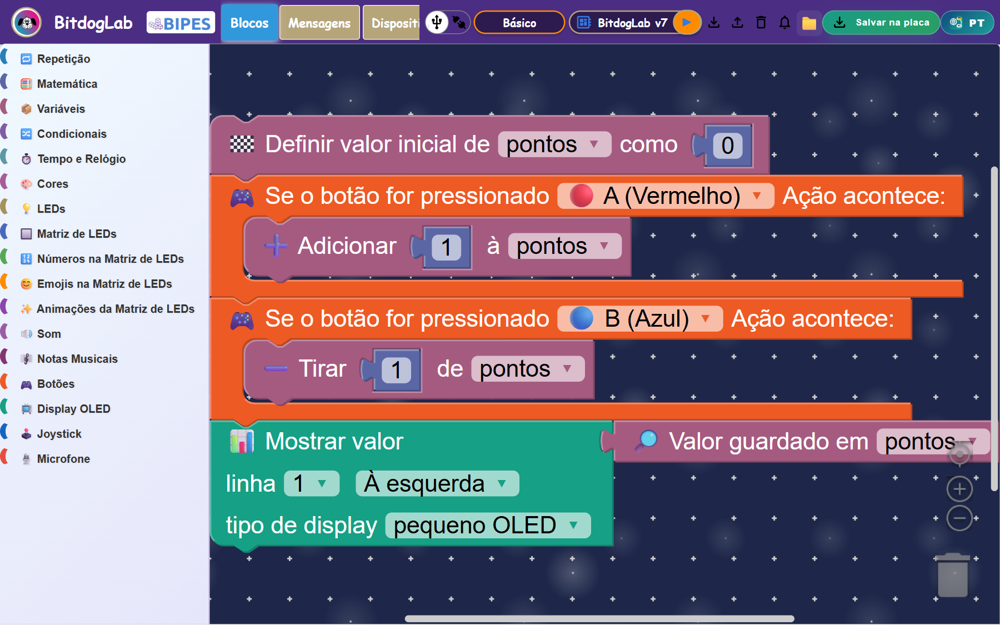
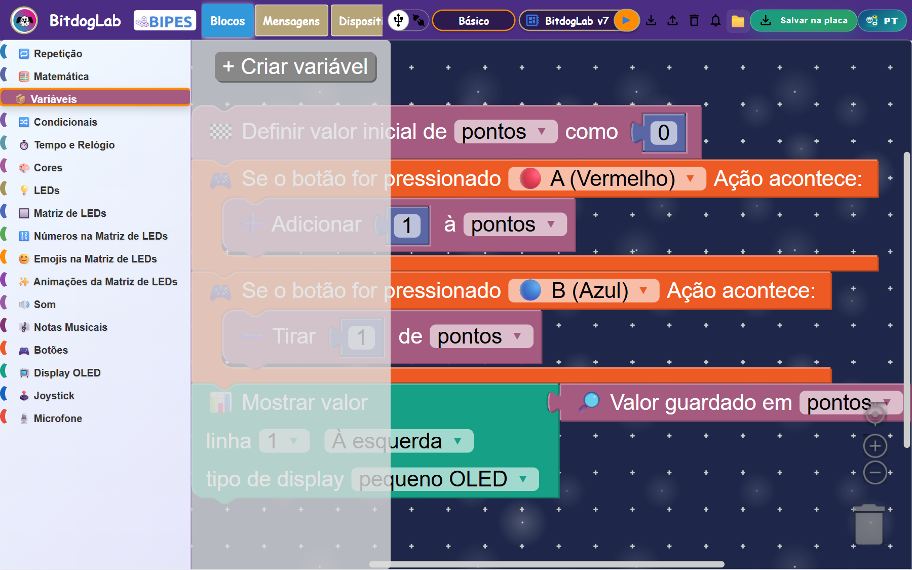
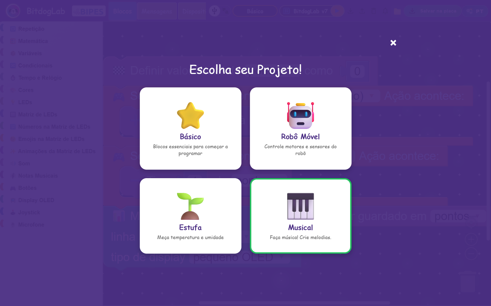
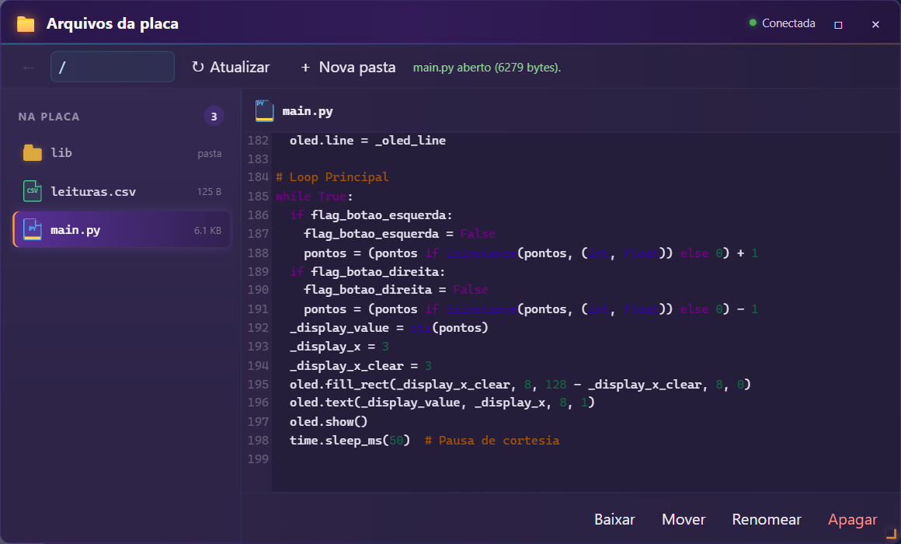
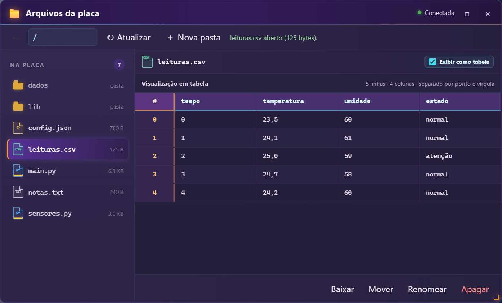
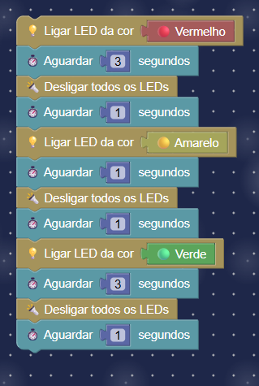
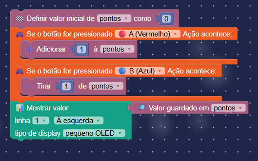
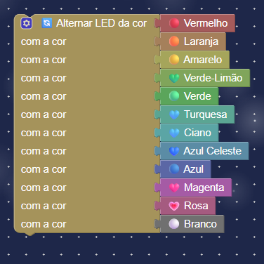
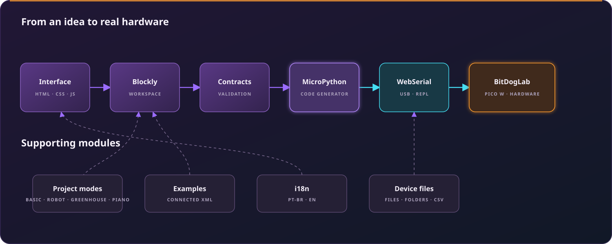

<p align="center">
  
</p>

<p align="center">
  <a href="README.md">Português</a> · <strong>English</strong> · <a href="README.es.md">Español</a>
</p>

<p align="center">
  
  
  
  
</p>

<p align="center"><strong>Tangible visual programming: children assemble blocks, generate MicroPython, and see the result happen on real hardware.</strong></p>

## The project

**BIPES BitDogLab Blocks** is an open source Blockly-based educational platform for teaching programming, electronics, and computational thinking with the BitDogLab board and Raspberry Pi Pico W. It runs in the browser, turns connected blocks into organized MicroPython, and sends the program to the board over USB through Web Serial.

The project is built around **tangibility**: blocks use direct language, icons, and actions tied to real peripherals. Turning on an LED, reading a button, displaying a value on the OLED, or animating the LED matrix should remain understandable before a child knows Python syntax.

## The interface in action



The example above combines a score variable, buttons A and B, and the OLED display. Blocks remain connected as an executable program while categories stay visible on the left.

<table>
  <tr>
    <td width="50%" align="center"><strong>Categories and tangible blocks</strong></td>
    <td width="50%" align="center"><strong>Project modes</strong></td>
  </tr>
  <tr>
    <td></td>
    <td></td>
  </tr>
</table>

The toolbox currently contains **25 categories**, filtered according to the selected project:

- **Basic:** logic, loops, mathematics, variables, timing, colors, and every integrated peripheral.
- **Mobile Robot:** motors, movement, tilt, and battery instrumentation.
- **Greenhouse:** sensor verification, temperature, humidity, and charts.
- **Music:** musical control and melody generation for the buzzer.

## From an idea to MicroPython



Every block has a visual definition and a generator. Before code generation, contracts check required connections and provide educational warnings. The final output separates imports, setup, and the main loop:

```python
pontos = 0

while True:
    if flag_botao_esquerda:
        pontos = pontos + 1
    if flag_botao_direita:
        pontos = pontos - 1
    oled.text(str(pontos), 3, 8)
    oled.show()
```

The program can be run directly, saved as `main.py`, or inspected inside the platform.

## Hardware brought to life

<p align="center">
  
</p>

Blocks cover the RGB LED, 5×5 RGB matrix, OLED, joystick, buttons, buzzer, musical notes, microphone, sensors, and project-specific Robot and Greenhouse resources. The interface provides hardware configurations for BitDogLab v6 and v7.

## Files stored on the board



The file manager browses folders and opens, downloads, moves, renames, or deletes board files. CSV files can automatically appear as a spreadsheet with headers and indexes, or as their original text. Its implementation is documented in [`device-file-manager/README.en.md`](device-file-manager/README.en.md).

## Ready-to-learn, ready-to-remix examples

The repository contains **56 connected XML projects** with matching validation images. They work as lessons, starting points, and regression checks.

<table>
  <tr>
    <td align="center"><strong>Traffic light</strong></td>
    <td align="center"><strong>Variable counter</strong></td>
    <td align="center"><strong>Rainbow</strong></td>
  </tr>
  <tr>
    <td></td>
    <td></td>
    <td></td>
  </tr>
</table>

## General architecture



The main flow stays simple: the interface feeds blocks into the Blockly workspace, contracts validate the program, generators produce MicroPython, and WebSerial communicates with the board. Project modes, examples, translations, and the device file manager support this flow without mixing responsibilities.

## Technologies

| Technology | Role |
| --- | --- |
| HTML5, CSS3, and JavaScript | Web interface, layout, and application behavior. |
| Blockly | Block workspace, connections, and serialization. |
| MicroPython | Code executed by the Raspberry Pi Pico W. |
| Web Serial API | USB communication with the board REPL. |
| CodeMirror | Python, text, and raw CSV viewing. |
| xterm.js | Serial console inside the browser. |

The application does not require a backend. The browser serves the interface and talks directly to the device authorized by the user.

## Repository organization

```text
BIPES-BITDOGLAB/
├── src/
│   ├── pages/                 # application pages
│   ├── styles/                # visual identity and layout
│   ├── js/
│   │   ├── blocks/            # definitions, generators, contracts
│   │   ├── communication/     # WebSerial and channels
│   │   ├── config/            # toolbox and board versions
│   │   ├── core/              # workspace, generation, bootstrap
│   │   └── ui/                # interface components
│   └── translations/          # single PT/EN catalog for the project and Blockly
├── device-file-manager/       # board files and folders
├── Examples/                  # connected XML projects
├── images/                    # examples and README images
├── micropython/               # MicroPython references and examples
├── firmware/                  # board support libraries
├── docs/                      # guides, checklists, technical notes
└── tests/                     # local automated validation
```

## Run locally

You need Chrome or Edge on a desktop computer, a USB data cable, and a BitDogLab with MicroPython installed.

```bash
git clone https://github.com/BitDogLab-Blocos/BIPES-BITDOGLAB.git
cd BIPES-BITDOGLAB
python -m http.server 5500
```

Open `http://127.0.0.1:5500`, select a project mode, connect the serial port, and assemble your program. The application does not require installing dependencies.

> Web Serial requires an explicit user action to select a port. Use `localhost`, `127.0.0.1`, or an HTTPS origin.

## Open source by design

Contributions from teachers, students, makers, and developers are welcome. You can:

- report a problem or propose an educational experiment;
- improve block language and accessibility;
- create a definition, generator, contract, and connected example for a new block;
- test on real hardware and share the results;
- translate documentation or review teaching materials.

When contributing, preserve tangibility, keep responsibilities inside their modules, and include an example that another person can open and run.

## Origins and license

This work is based on [BIPES](https://bipes.net.br/), created by Rafael Vidal Aroca and contributors, and evolves with the BitDogLab Blocks community. It is distributed under the [GNU General Public License v3.0](LICENSE): use, study, modify, and share it while preserving the same freedoms.
