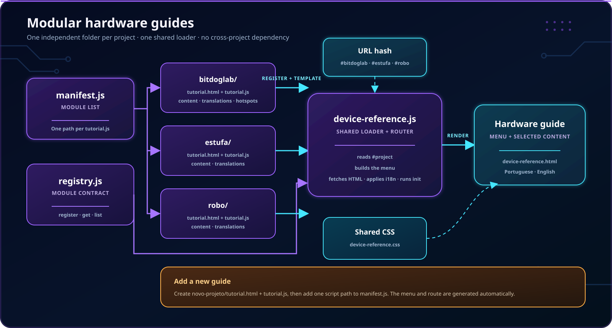

# Guias de hardware do BIPES–BitDogLab

**Português** · [Read in English](README.en.md)

Os tutoriais exibidos na aba **Dispositivo** vivem em `src/hardware-guides/`. Cada guia controla seu conteúdo, traduções e interações sem depender dos outros projetos.



## Como o carregamento funciona

```text
manifest.js
    ↓ lista os módulos
<projeto>/tutorial.js
    ↓ registra metadados e comportamento
registry.js
    ↓ valida e ordena
device-reference.js
    ↓ carrega o template e aplica o idioma
<projeto>/tutorial.html
```

| Parte | Responsabilidade |
| --- | --- |
| `manifest.js` | Lista os scripts de tutorial carregados pela página. |
| `registry.js` | Valida, registra e ordena módulos. |
| `<projeto>/tutorial.html` | Conteúdo original em português e marcações de tradução. |
| `<projeto>/tutorial.js` | Menu, template, traduções e comportamento exclusivo. |
| `<projeto>/tutorial.css` | Estilo opcional e isolado do projeto. |
| `src/js/ui/device-reference.js` | Navegação, carregamento, idioma e ciclo de vida. |
| `src/styles/device-reference.css` | Componentes visuais compartilhados. |

## Projetos existentes

```text
hardware-guides/
├── bitdoglab/         # visão geral da placa
├── estufa/            # AHT20 e montagem da estufa
├── robo/              # chassi, ponte H e MPU6050
├── images/            # imagens desta documentação
├── manifest.js
└── registry.js
```

Retirar um script do manifesto remove somente aquele item do menu. Os diretórios de projeto não importam código uns dos outros.

## Contrato de um módulo

O arquivo `tutorial.js` registra um objeto com `DeviceHardwareGuides.register`:

| Campo | Obrigatório | Descrição |
| --- | --- | --- |
| `id` | Sim | Identificador minúsculo usado no menu e no hash. |
| `template` | Sim | Caminho do fragmento HTML relativo à página hospedeira. |
| `menu` | Sim | Título e descrição em `pt-br` e `en`. |
| `order` | Recomendado | Ordem numérica do item no menu. |
| `translations.en` | Para inglês | Textos correspondentes às chaves `data-copy`. |
| `init(context)` | Não | Inicialização de controles exclusivos do guia. |
| `stylesheet` | Não | Folha de estilo carregada somente para esse módulo. |

`init` recebe `{ root, lang }`. Toda busca no DOM deve começar em `context.root`; isso evita colisões entre tutoriais.

## Criar um novo guia

O exemplo abaixo adiciona `sensor-luz`.

### 1. Crie os arquivos

```text
hardware-guides/sensor-luz/
├── tutorial.html
└── tutorial.js
```

O nome da pasta e o `id` devem ser iguais, sem espaços, acentos ou letras maiúsculas.

### 2. Escreva o HTML em português

```html
<section class="project-panel is-active"
         id="sensor-luz"
         data-panel="sensor-luz">
  <header class="article-header">
    <p class="article-index" data-copy="eyebrow">PROJETO SENSOR DE LUZ</p>
    <h2 data-copy="title">Medindo a luminosidade</h2>
    <p data-copy="intro">Aprenda a conectar e testar o sensor.</p>
  </header>

  <figure class="component-figure">
    
    <figcaption data-copy="imageCaption">Sensor usado no projeto.</figcaption>
  </figure>
</section>
```

Regras do template:

- mantenha um conteúdo útil mesmo quando JavaScript falhar;
- use `data-copy` somente no elemento cujo `textContent` será substituído;
- use `data-copy-alt` para o texto alternativo de imagens;
- referencie assets a partir de `src/pages/device-reference.html`, a página que renderiza o fragmento.

### 3. Registre metadados e traduções

```js
(function (registry) {
  'use strict';

  registry.register({
    id: 'sensor-luz',
    order: 4,
    template: '../hardware-guides/sensor-luz/tutorial.html',
    menu: {
      'pt-br': { title: 'Sensor de luz', description: 'Luminosidade ambiente' },
      en: { title: 'Light sensor', description: 'Ambient light' }
    },
    translations: {
      en: {
        eyebrow: 'LIGHT SENSOR PROJECT',
        title: 'Measuring light levels',
        intro: 'Learn how to connect and test the sensor.',
        imageAlt: 'Light sensor',
        imageCaption: 'Sensor used by the project.'
      }
    }
  });
})(window.DeviceHardwareGuides);
```

### 4. Adicione o script ao manifesto

```js
window.DeviceHardwareGuideScripts = [
  '../hardware-guides/bitdoglab/tutorial.js',
  '../hardware-guides/estufa/tutorial.js',
  '../hardware-guides/robo/tutorial.js',
  '../hardware-guides/sensor-luz/tutorial.js'
];
```

Não crie o botão manualmente: o menu é derivado do registro.

### 5. Adicione interação somente se necessário

```js
init: function (context) {
  var button = context.root.querySelector('#testLightSensor');
  if (!button) return;

  button.addEventListener('click', function () {
    button.textContent = context.lang === 'en' ? 'Reviewed' : 'Conferido';
  });
}
```

Para estilos, reutilize primeiro `device-reference.css`. Se houver uma necessidade exclusiva, declare `stylesheet: '../hardware-guides/sensor-luz/tutorial.css'`.

## Validação

Sirva o projeto por HTTP e abra:

```text
src/pages/device-reference.html#sensor-luz
src/pages/device-reference.html?lang=en#sensor-luz
```

Confira menu, hash, português, inglês, imagens, responsividade e ausência de estilos ou eventos residuais ao trocar de guia. Depois execute:

```powershell
node --test tests/i18n/*.test.js
node tests/examples_generation_smoke.js
```

## Guia não é categoria Blockly

O manifesto cria conteúdo na aba **Dispositivo**. Para o mesmo hardware também aparecer em **Projetos**, cadastre separadamente o cartão em `src/pages/index.html`, as categorias em `src/js/config/toolbox.xml` e o nome em `WorkspaceManager.PROJECT_NAMES`.
