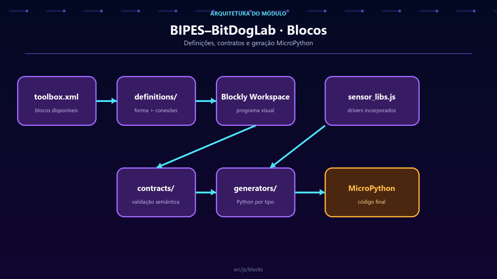

# BIPES–BitDogLab Blockly blocks

[Leia em português](README.md) · **English**

`src/js/blocks/` defines the BIPES–BitDogLab visual language. Every Blockly type has an appearance, connection rules, and a Python translation. The folder also protects users from semantically invalid combinations.



## Block flow

```text
toolbox.xml → definition → contract → generator → core/codegen → MicroPython
```

| Path | Responsibility |
| --- | --- |
| `definitions/` | Blockly shape, fields, inputs, outputs, and connections. |
| `generators/` | Python imports, setup, and instructions for each type. |
| `contracts/types.js` | Semantic domains accepted by connections. |
| `contracts/registry.js` | Requirements, dependencies, and bilingual messages. |
| `contracts/external_resources.js` | Physical resources shared by external peripherals. |
| `contracts/validator.js` | Workspace warnings and invalid-code blocking. |
| `registry.js` | Checks that every toolbox type has a definition and generator. |
| `sensor_libs.js` | MicroPython drivers embedded by selected generators. |

Definition and generator `index.js` files are entry points; domain implementations should not accumulate in them.

## Type identity

The same identifier must appear in three places:

```js
Blockly.Blocks['my_block'] = {
  init: function() {
    this.appendDummyInput().appendField('My block');
    this.setPreviousStatement(true);
    this.setNextStatement(true);
  }
};

Blockly.Python['my_block'] = function() {
  return 'print("BitDogLab")\n';
};
```

```xml
<block type="my_block"></block>
```

Renaming a type breaks saved XML projects. If a change is unavoidable, implement migration support before removing the old identifier.

## Adding a block

1. Choose the matching domain file under `definitions/`.
2. Register the definition with a unique, stable type.
3. Create its matching generator under `generators/`.
4. Add the type to `src/js/config/toolbox.xml`.
5. Register a domain or contract when connection or context restrictions exist.
6. Add Portuguese and English messages.
7. Create at least one XML example that exercises the generator.

## Generator rules

- Read pins and peripherals from `BitdogLabConfig`; never scatter GPIO numbers.
- Store imports and initializations in `Blockly.Python.definitions_`.
- Use `BitdogLabConfig.MARKERS` for setup and loop boundaries.
- Preserve Blockly return formats: a string for statements and `[code, order]` for values.
- Do not translate MicroPython identifiers directly; `core/i18n/` handles final code.
- Reuse existing helpers and drivers before duplicating generated Python.

## Load order

`src/pages/index.html` must load contracts and definitions before their consumers. The browser runs `BlockRegistry.validateToolbox()` to detect missing types early.

## Required validation

```powershell
node tests/block_contracts_smoke.js
node tests/examples_generation_smoke.js
node --test tests/i18n/*.test.js
```

A block change is ready only when every example imports into real Blockly, no type lacks a generator, and generated Python remains valid for V6 and V7.
