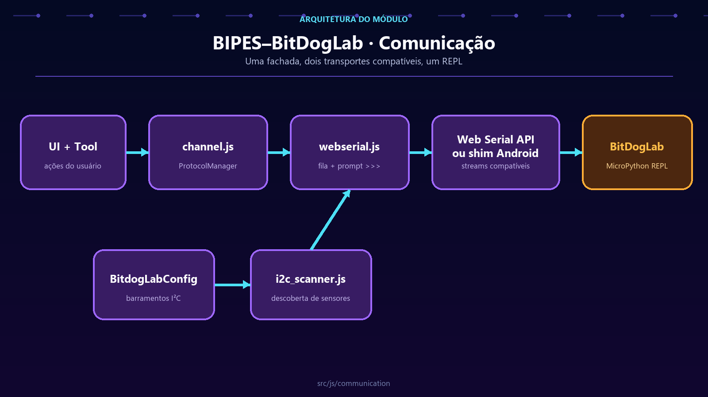

# Comunicação do BIPES–BitDogLab

**Português** · [Read in English](README.en.md)

`src/js/communication/` mantém uma sessão confiável entre a interface e o REPL MicroPython. Fila, porta serial e descoberta I²C ficam aqui; botões, notificações e geração de código pertencem a outras camadas.



## Componentes

| Arquivo | Papel |
| --- | --- |
| `channel.js` | Constantes, fila de transmissão, callbacks e fachada `ProtocolManager`. |
| `webserial.js` | Porta, streams, leitura, escrita e reconhecimento do prompt `>>>`. |
| `i2c_scanner.js` | Varredura dos barramentos e eventos de sensores conhecidos. |

As classes modernas mantêm aliases globais legados porque outros módulos e projetos publicados ainda usam `mux` e `webserial`.

## Objetos em execução

```js
var Channel = {};
Channel.webserial = new webserial();
Channel.mux = new mux();
```

`Channel.mux` é a entrada usada pelo restante da aplicação. Ele não acessa a porta diretamente: organiza comandos e delega a transmissão a `Channel.webserial`.

## Fluxo de conexão

```text
UI → ProtocolManager → WebSerialProtocol → navigator.serial → BitDogLab
                              ↑                         ↓
                         fila/callbacks ← bytes e prompt
```

1. A interface solicita conexão.
2. Web Serial pede autorização e abre a porta.
3. O leitor contínuo converte bytes recebidos em texto.
4. O protocolo identifica prompts e conclui callbacks pendentes.
5. Comandos são divididos em pacotes e enviados na ordem da fila.
6. Ao desconectar, estado, fila e interface retornam a uma condição conhecida.

No aplicativo Android, um shim nativo implementa `navigator.serial`. O protocolo web permanece o mesmo; não adicione condicionais Android à fila quando a ponte já puder reproduzir o contrato do navegador.

## Regras da fila

- `bufferPush` adiciona comandos normais e preserva a ordem dos callbacks.
- `bufferUnshift` coloca uma operação urgente no início.
- `clearBuffer` cancela pacotes e callbacks ainda não enviados.
- Quebras de linha e tamanho de pacote são normalizados antes da transmissão.
- Operações sem conexão devem notificar o usuário sem alterar silenciosamente a fila.

Não envie bytes diretamente de componentes de UI. Novas operações devem passar pela fachada ou por um serviço de execução que use essa fachada.

## Scanner I²C

O scanner lê barramentos e endereços de `BitdogLabConfig`. Ele pausa enquanto o programa do usuário executa ou enquanto outra transação controla o REPL. Isso evita que uma sondagem interrompa gravações, listagens de arquivo ou execução de código.

Dispositivos conhecidos são definidos em `BitdogLabConfig.SENSOR.I2C_KNOWN_DEVICES`. Acrescente um endereço ao perfil da placa, não ao scanner.

## Restrições do navegador

Web Serial exige navegador compatível, contexto seguro e autorização explícita do usuário. Testes automatizados simulam a porta; a validação manual com hardware deve conferir conexão, reconexão, remoção física e recuperação do prompt.

## Validação

```powershell
node --test tests/communication/*.test.js
node --test tests/device-files/*.test.js
node --test src/mobile/tests/mobile-serial-shim.test.js
```

Uma alteração está pronta quando preserva a ordem da fila, não deixa callbacks órfãos e mantém o mesmo comportamento no navegador e no shim Android.
