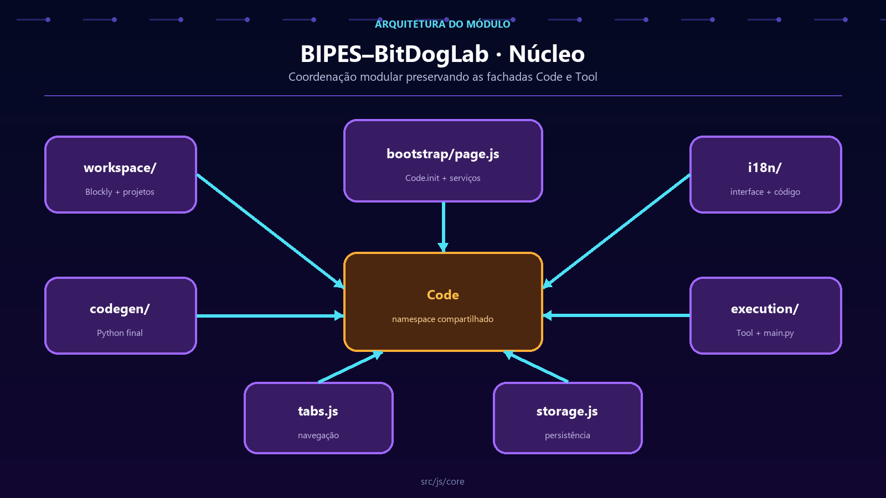

# Núcleo web do BIPES–BitDogLab

**Português** · [Read in English](README.en.md)

`src/js/core/` coordena Blockly, geração de Python, execução, navegação, idioma e persistência. O núcleo conecta módulos; ele não deve reimplementar blocos, transporte serial nem componentes visuais.



## Mapa dos módulos

| Caminho | Responsabilidade |
| --- | --- |
| `app.js` | Inicialização do núcleo e seleção V6/V7. |
| `workspace/` | Ciclo Blockly, toolbox, projetos e lembretes. |
| `codegen/` | Validação, organização do Python e geração automática. |
| `execution/` | Executar, interromper, reiniciar e gravar `main.py`. |
| `i18n/` | Interface, Blockly e tradução segura do código gerado. |
| `tabs.js` | Estado, renderização e redimensionamento dos painéis. |
| `language.js` | Idioma ativo, direção da página e catálogo. |
| `storage.js` | Projetos, backups e restauração da última sessão. |
| `terminal.js` | Instância e integração do terminal. |
| `dom.js` | Helpers pequenos e específicos de DOM/animação. |
| `utils.js` | Entrada legada que mantém consumidores antigos funcionando. |

## Submódulos

### `workspace/`

- `lifecycle.js`: cria, carrega, redimensiona e limpa o workspace;
- `toolbox.js`: carrega o XML e filtra categorias por projeto;
- `projects.js`: seletor, persistência e avisos de hardware;
- `hints.js`: lembretes contextuais para blocos especiais;
- `index.js`: publica a fachada compatível em `Code`.

### `codegen/`

- `python-organizer.js`: separa setup, loop, imports e definições;
- `generator.js`: valida o workspace e monta o Python final;
- `auto-generation.js`: atualiza o código após mudanças;
- `index.js`: publica `Code.generateCode` e a geração automática.

### `execution/`

- `runner.js`: execução, parada e reinicialização;
- `main-file.js`: protocolo ordenado para gravar `main.py`;
- `index.js`: preserva a fachada global `Tool`.

### `i18n/`

- `interface.js`: DOM, toolbox e controles de idioma;
- `generated-code.js`: identificadores, comentários e strings MicroPython;
- `index.js`: API pública de tradução.

## Inicialização

Os scripts clássicos estendem o mesmo namespace:

```js
var Code = window.Code || (window.Code = {});
```

Após o carregamento, `bootstrap/page.js` chama `Code.init()`. `app.js` ativa idioma, workspace, abas, geração automática, armazenamento e gerenciador de arquivos. A ordem em `src/pages/index.html` é parte do contrato: um módulo deve ser carregado antes do bootstrap que o consome.

## Fachadas públicas

| Global | Consumidores |
| --- | --- |
| `Code` | página, Blockly, projetos, abas e idioma. |
| `Tool` | botões de execução e gravação. |
| `term` | comunicação e painel de mensagens. |
| `DOM` / `Animate` | compatibilidade de componentes existentes. |

Não renomeie nem substitua essas fachadas sem migração. Módulos novos devem publicar apenas a menor API necessária.

## Onde colocar código novo

- comportamento do workspace → `workspace/`;
- transformação de Python → `codegen/`;
- comando enviado à placa → `execution/` ou `communication/`;
- tradução → `i18n/` e `src/translations/catalog.js`;
- comportamento visual → `src/js/ui/`;
- regra de um bloco → `src/js/blocks/`.

Evite novos arquivos genéricos chamados `utils.js`. Um nome de domínio torna descoberta, testes e manutenção mais simples.

## Invariantes

- `Code.generateCode()` continua sendo a entrada de geração.
- XMLs salvos mantêm seus tipos e campos Blockly.
- O Python final preserva setup antes do loop.
- A troca de idioma não altera APIs MicroPython.
- A troca V6/V7 muda apenas `BitdogLabConfig` ativo.
- Execução e gravação passam pelo protocolo serial existente.

## Validação

```powershell
node tests/examples_generation_smoke.js
node tests/block_contracts_smoke.js
node --test tests/i18n/*.test.js tests/communication/*.test.js
```

Para mudanças de interface, abra a aplicação e valide onboarding, projetos, abas, idiomas, V6/V7, geração e execução sem erros de página.
