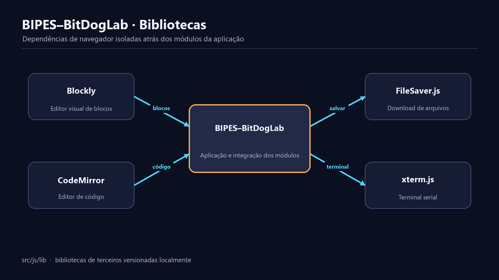

# Bibliotecas do BIPES–BitDogLab

**Português** · [Read in English](README.en.md)

`src/js/lib/` guarda distribuições de terceiros carregadas diretamente pela página. A aplicação funciona offline porque Blockly, CodeMirror, FileSaver e xterm ficam no próprio repositório.



## Dependências

| Caminho | API usada pela aplicação |
| --- | --- |
| `blockly/blockly_compressed.js` | Workspace, toolbox, conexões e serialização XML. |
| `blockly/python_compressed.js` | Infraestrutura base de geração Python. |
| `blockly/msg/` | Mensagens originais do Blockly. |
| `codemirror/` | Editor, CSS e modo de sintaxe Python. |
| `filesaver/FileSaver.js` | Download de XML e outros conteúdos locais. |
| `xterm/xterm.js` | Terminal para entrada e saída serial. |

Código específico da BitDogLab não pertence aqui. Extensões Blockly ficam em `src/js/blocks/`; integração do terminal fica em `src/js/core/terminal.js`.

## Carregamento

As distribuições expõem globais por scripts clássicos:

```html
<script src="../js/lib/blockly/blockly_compressed.js"></script>
<script src="../js/lib/blockly/python_compressed.js"></script>
<script src="../js/lib/filesaver/FileSaver.js"></script>
<script src="../js/lib/xterm/xterm.js"></script>
<script src="../js/lib/codemirror/codemirror.js"></script>
```

A ordem é relevante: o núcleo de cada biblioteca vem antes de plugins, modos, mensagens e extensões locais.

## Política de alteração

- Não edite arquivos comprimidos para corrigir comportamento da aplicação.
- Não execute formatadores sobre uma distribuição vendorizada.
- Preserve cabeçalhos de licença, nomes, caminhos e arquivos auxiliares.
- Registre a origem e versão quando atualizar uma dependência.
- Atualize o conjunto completo fornecido pela distribuição oficial, não apenas um arquivo isolado.
- Verifique se a atualização continua funcionando sem CDN e sem rede.

Uma adaptação inevitável deve ficar em um arquivo próprio fora de `lib/`, carregado depois da biblioteca e documentado como compatibilidade.

## Atualizar uma biblioteca

1. Identifique a versão atualmente utilizada e as APIs globais consumidas.
2. Baixe a nova distribuição da fonte oficial.
3. Compare licenças, estrutura de pastas e nomes de entrada.
4. Substitua somente a árvore da biblioteca correspondente.
5. Abra a interface e valide XMLs antigos, toolbox, editor e terminal.
6. Execute toda a suíte de exemplos e contratos.
7. Confira o pacote Android, que copia os mesmos assets web.

## Riscos de compatibilidade

Blockly é a dependência mais sensível: tipos, campos XML, APIs de gerador e comportamento de conexão precisam permanecer compatíveis com projetos salvos. CodeMirror e xterm também expõem estilos e métodos usados por código legado.

## Validação

```powershell
node tests/examples_generation_smoke.js
node tests/block_contracts_smoke.js
node --test tests/**/*.test.js
node --test src/mobile/tests/*.test.js
```

Antes de publicar, teste em um navegador compatível sem cache e confirme que nenhuma biblioteca é buscada em uma URL externa.
