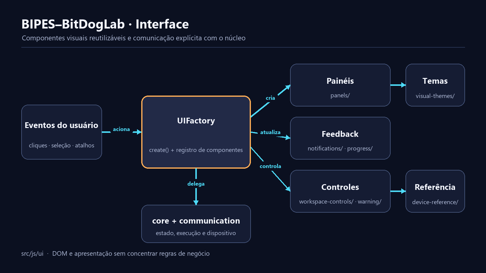

# Interface do BIPES–BitDogLab

**Português** · [Read in English](README.en.md)

`src/js/ui/` liga eventos do navegador aos serviços da aplicação. Esta camada pode atualizar o DOM e encaminhar ações; regras Blockly, geração Python, armazenamento de protocolo e transporte serial permanecem em seus próprios módulos.



## Componentes

| Arquivo | Responsabilidade |
| --- | --- |
| `ui.js` | Cria o registro global `UI` e conecta os componentes. |
| `panels.js` | Toolbar, painel de canal, idioma e responsividade. |
| `notifications.js` | Mensagens temporárias e histórico de diagnóstico. |
| `progress.js` | Progresso de transmissão e operações de arquivo. |
| `workspace-controls.js` | Conexão, execução, dispositivo, salvar e carregar XML. |
| `visual-themes.js` | Catálogo, persistência e aplicação dos temas. |
| `block_warning_ui.js` | Aparência e quebra de linha dos avisos em blocos. |
| `device-reference.js` | Menu, carregamento e navegação dos guias de hardware. |

## Registro global

O bootstrap cria uma única coleção:

```js
var UI = UIFactory.create();
```

Consumidores existentes usam chaves estáveis:

```js
UI.notify.send(message);
UI.progress.start(total);
UI.workspace.save();
```

Alguns módulos ainda usam a forma `UI['notify']`; as duas devem continuar válidas. `UI.account` também permanece disponível para o armazenamento legado.

## Fluxo de uma ação

```text
evento DOM → componente UI → serviço de domínio → resultado → notify/progress/DOM
```

Por exemplo, o botão **Executar** não implementa o protocolo: `workspace-controls.js` solicita a ação a `Tool`, que usa execução e comunicação. Essa separação permite testar o serviço sem reproduzir a tela inteira.

## Criar ou dividir um componente

1. Identifique um único estado visual ou grupo de controles.
2. Mantenha seletores e listeners no arquivo do componente.
3. Receba serviços existentes em vez de copiar sua lógica.
4. Exponha somente os métodos usados por outros módulos.
5. Registre a instância em `UIFactory.create()` quando precisar ser pública.
6. Confirme a ordem do script em `src/pages/index.html`.

Não crie um componente apenas para uma função curta sem estado. A divisão deve tornar a localização do comportamento mais óbvia.

## Temas visuais

`visual-themes.js` controla tokens e classes da interface. Imagens de tema ficam em `src/assets/images/themes/`. Um tema novo precisa de identificador estável, rótulo bilíngue, contraste legível e persistência compatível com valores já salvos.

## Guias de hardware

`device-reference.js` é apenas o hospedeiro. Conteúdo e interações de cada tutorial pertencem a `src/hardware-guides/<projeto>/`; estilos compartilhados ficam em `src/styles/device-reference.css`.

## Dependências globais

A camada ainda conversa com `Code`, `Channel`, `Files`, `Tool`, `term` e o registro `UI`. Preserve essas fachadas enquanto scripts clássicos forem suportados. Dependências novas devem ser explícitas no ponto de criação sempre que possível.

## Acessibilidade e segurança

- mantenha `aria-expanded`, `aria-hidden` e foco sincronizados com painéis;
- use `textContent` para valores externos e mensagens de dispositivo;
- não dependa apenas de cor para indicar estado;
- verifique teclado, telas estreitas e zoom;
- notificações não devem inserir HTML não confiável.

## Validação

```powershell
node tests/examples_generation_smoke.js
node --test tests/i18n/*.test.js
node --test src/mobile/tests/mobile-workspace.test.js src/mobile/tests/mobile-security.test.js
```

No navegador, valide onboarding, toolbar, projetos, V6/V7, temas, idiomas, abas e redimensionamento sem erros de página.
