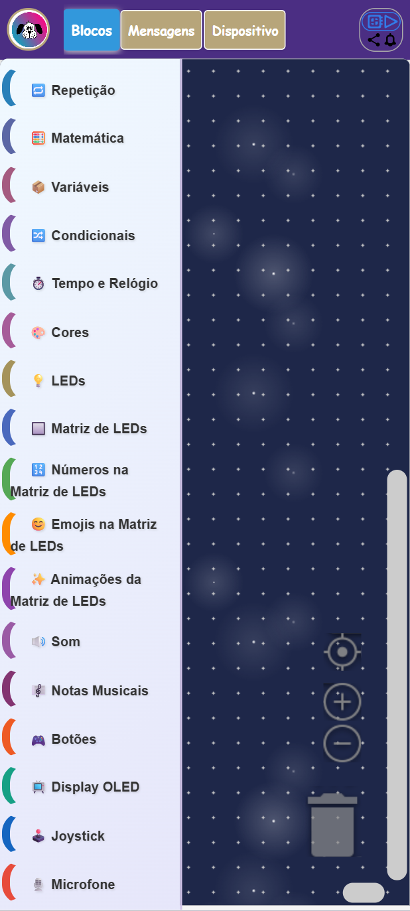
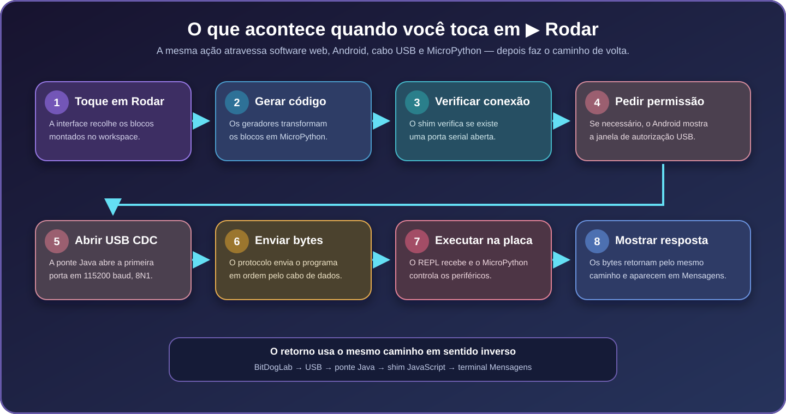

<div align="center">
  

  # BitDogLab-Blocos para Android

  **A interface BIPES–BitDogLab empacotada para Android com USB CDC nativo.**

  `versão 0.3.6` · `Android 8+` · `USB Host/OTG` · `MicroPython`
</div>

## Visão geral

`src/mobile/` transforma a plataforma web existente em um APK. Blocos, geradores, projetos, idiomas, terminal, arquivos e guias continuam sendo os mesmos do navegador. O código Android acrescenta somente o que o celular precisa:

- WebView segura para os assets locais;
- layout adaptado para toque, retrato e paisagem;
- descoberta e permissão USB Host;
- ponte CDC/ACM entre JavaScript e RP2040;
- empacotamento e assinatura do APK.


Não existe uma segunda interface em Java. A tarefa Gradle `prepareWebAssets` copia `src/` e `device-file-manager/` para o diretório de build, e o APK abre `src/pages/index.html?mobile=1`.

## Web e Android

```text
Computador: navegador → Web Serial → USB CDC → MicroPython
Android:    WebView → shim serial → ponte USB Host → USB CDC → MicroPython
```

O Python gerado e o protocolo de alto nível são iguais. Muda apenas o transporte oferecido como `navigator.serial`.

O aplicativo não usa Flutter, React Native, Bluetooth, Wi-Fi, WebUSB, servidor intermediário ou firmware especial. Também não precisa de root nem de conexão com a internet durante o uso.

## Vocabulário rápido

| Termo | Significado no projeto |
| --- | --- |
| APK | Pacote instalável que reúne código, recursos e configuração Android. |
| WebView | Navegador incorporado que apresenta HTML, CSS e JavaScript. |
| USB Host / OTG | Modo em que o celular controla o dispositivo USB conectado. |
| CDC/ACM | Padrão que expõe a BitDogLab como porta serial. |
| Ponte nativa | Java que acessa USB em nome do JavaScript autorizado. |
| Shim | Compatibilidade que apresenta a ponte como `navigator.serial`. |
| REPL | Terminal MicroPython que recebe, interrompe e executa código. |
| Debug | APK de desenvolvimento assinado automaticamente. |
| Release | APK de distribuição assinado por uma chave permanente. |

## Requisitos para usar

- celular ou tablet com Android 8.0 ou mais recente;
- suporte USB Host/OTG;
- adaptador OTG compatível;
- cabo USB de dados;
- BitDogLab com o MicroPython padrão.

```text
Android → adaptador OTG → cabo USB de dados → BitDogLab
```

Um cabo somente de energia pode acender a placa, mas não transporta programas. A bateria da placa também não substitui a conexão de dados.

## Interface móvel

As capturas usam uma tela de 412 × 915 pixels. As adaptações móveis entram somente no APK e não mudam o site.

<table>
  <tr>
    <td align="center"><strong>Workspace</strong></td>
    <td align="center"><strong>Ferramentas</strong></td>
  </tr>
  <tr>
    <td></td>
    <td></td>
  </tr>
</table>

| Controle | Ação |
| --- | --- |
| **Blocos** | Mostra o workspace e as categorias Blockly. |
| **‹ / ›** | Recolhe ou restaura a toolbox. |
| **Mensagens** | Abre terminal, saída e controles de parada. |
| **Dispositivo** | Abre referência da placa e tutoriais. |
| **Ferramentas** | Mostra conexão, projeto, revisão, arquivos, tema e idioma. |
| **Plugue** | Conecta ou desconecta manualmente. |
| **▶ Rodar** | Conecta se necessário, gera e envia o programa. |
| **Salvar na placa** | Grava o programa como `main.py`. |

## Primeiro uso

1. Instale o APK.
2. Conecte adaptador OTG, cabo de dados e BitDogLab.
3. Abra o aplicativo.
4. Aceite a permissão USB do Android.
5. Monte um programa simples.
6. Toque em **▶ Rodar** e acompanhe **Mensagens**.

## Conectar, rodar e parar


**Conectar** abre o caminho USB; **Rodar** produz e envia o código. Rodar e Salvar tentam conectar automaticamente quando a porta ainda não está pronta.



### Seleção da BitDogLab

O Android enumera portas CDC/ACM e aceita o Vendor ID `0x2E8A` (`11914`), usado pelo RP2040. Após a permissão, a primeira porta é aberta em `115200 baud`, `8N1`.

O filtro está em [`device_filter.xml`](android/app/src/main/res/xml/device_filter.xml), e a seleção em [`NativeSerialBridge.java`](android/app/src/main/java/org/bitdoglab/bipes/NativeSerialBridge.java).

### Execução

1. Blockly gera o mesmo MicroPython da versão web.
2. A conexão é aberta quando necessário.
3. O protocolo envia os pacotes em ordem.
4. A resposta retorna até o prompt `>>>`.
5. A saída aparece em **Mensagens**.

O JavaScript agrupa chamadas para reduzir travessias da ponte. O Java volta a dividir cada lote em blocos físicos de 100 bytes com pequeno intervalo, evitando sobrecarregar o buffer da placa.

### Parada e nova execução

O botão **Parar** precisa resolver dois estados:

- código ainda em transmissão: cancela o restante entre blocos físicos;
- código já executando: envia `Ctrl+C` ao MicroPython até recuperar `>>>`.

A recuperação automática ao conectar também usa `Ctrl+C`, mas não representa uma parada manual. `mobile_serial_shim.js` considera o contexto para manter porta nativa, protocolo web e indicador visual sincronizados. O teste de recuperação protege o ciclo **Conectar → Rodar → Parar → Rodar** sem retirar o cabo.

## Ponte USB


| Camada | Responsabilidade |
| --- | --- |
| interface compartilhada | Blocos, Python, terminal, projetos, arquivos e scanner I²C. |
| `mobile_serial_shim.js` | `ReadableStream`, `WritableStream` e contrato `navigator.serial`. |
| `NativeSerialBridge.java` | Permissão, CDC, leitura, escrita, parada e retirada física. |
| Android USB Host | Acesso OTG sem root. |
| MicroPython | REPL, execução e `main.py`. |

A ponte `BitDogLabUsbNative` é exposta somente à origem HTTPS local e ao frame principal. Dados binários atravessam a fronteira em Base64. O `webserial.js` compartilhado continua reconhecendo prompt, callbacks e fila.

## Arquivos do dispositivo

Terminal, scanner e gerenciador reutilizam a mesma porta. Operações de arquivo usam uma transação nativa exclusiva porque respostas longas poderiam competir com o leitor assíncrono:

1. o shim pede a transação;
2. a ponte pausa o leitor geral;
3. recupera o prompt normal;
4. envia o comando e lê até um marcador exclusivo;
5. restaura o leitor do terminal.

Os atrasos adicionais existem somente no Android. O navegador preserva o fluxo Web Serial anterior.

## Estrutura

```text
src/mobile/
├── README.md
├── docs/images/                    # diagramas e capturas deste guia
├── scripts/check-web-boundary.mjs  # verifica hashes web sensíveis
├── tests/                          # contratos Android e do shim
├── web-boundary.json               # linha de base da fronteira web
└── android/
    └── app/src/main/
        ├── AndroidManifest.xml
        ├── java/org/bitdoglab/bipes/
        │   ├── MainActivity.java
        │   └── NativeSerialBridge.java
        └── res/
            ├── raw/mobile_layout.css
            ├── raw/mobile_serial_shim.js
            ├── raw/mobile_content_hardening.js
            ├── raw/mobile_workspace.js
            └── xml/device_filter.xml
```

| Arquivo | Papel |
| --- | --- |
| `MainActivity.java` | WebView, origem local, políticas de navegação e ponte. |
| `NativeSerialBridge.java` | Implementação USB CDC nativa. |
| `mobile_serial_shim.js` | Adaptação da ponte ao protocolo Web Serial. |
| `mobile_layout.css` | Toque, orientação, áreas seguras e layout compacto. |
| `mobile_workspace.js` | Recolhimento da toolbox e redimensionamento Blockly. |
| `mobile_content_hardening.js` | Renderização segura de valores variáveis. |

## Como os assets entram no APK

`prepareWebAssets` copia as fontes para `android/app/build/generated/webAssets/`. O diretório é temporário, ignorado pelo Git e removido por `gradlew clean`. Nunca edite essa cópia.

Antes da página iniciar, o Android injeta layout, shim serial, proteção de conteúdo e controle móvel do workspace. O catálogo PT/EN vem da mesma fonte web.


## Compilar o APK debug

Requisitos:

- JDK 17 e `JAVA_HOME`;
- Android SDK com plataforma 36;
- `ANDROID_HOME` ou `android/local.properties`;
- Node.js para os testes.

```powershell
cd src/mobile/android
.\gradlew.bat clean lintDebug assembleDebug
```

Saída:

```text
app/build/outputs/apk/debug/app-debug.apk
```

Instalação por ADB:

```powershell
adb install -r .\src\mobile\android\app\build\outputs\apk\debug\app-debug.apk
```

## Compilar release

Crie `src/mobile/android/keystore.properties` fora do Git:

```properties
storeFile=C:/caminho/seguro/bitdoglab-release.jks
storePassword=SENHA_LOCAL
keyAlias=bitdoglab
keyPassword=SENHA_LOCAL
```

```powershell
cd src/mobile/android
.\gradlew.bat clean lintRelease assembleRelease
```

O resultado fica em `app/build/outputs/apk/release/app-release.apk`. Guarde a chave: atualizações futuras do mesmo pacote precisam da mesma assinatura.

## Segurança

- assets carregados por origem HTTPS local, nunca `file://`;
- sem permissão de internet e sem tráfego HTTP claro;
- ponte restrita à origem local e ao frame principal;
- somente VID do RP2040 e mensagens com tamanho limitado;
- conteúdo variável inserido como texto, não HTML;
- cookies, conteúdo misto, cache de rede e backup desativados;
- links externos encaminhados ao aplicativo apropriado;
- chave de assinatura, APKs e outputs permanecem fora do Git.

## Problemas comuns

| Sintoma | Verificação |
| --- | --- |
| Placa acende, mas não aparece | Troque o cabo por um modelo de dados e confirme OTG. |
| Permissão USB não aparece | Reconecte com a tela desbloqueada e reabra o app. |
| Permissão negada | Remova, reconecte e aceite a solicitação do Android. |
| Rodar não produz saída | Abra **Mensagens**, conecte manualmente e confira o prompt. |
| Conecta e desconecta visualmente | Instale versão atual e aguarde a recuperação inicial. |
| Gradle não encontra SDK | Corrija `ANDROID_HOME` ou `local.properties`. |
| Gradle não encontra Java | Instale JDK 17 e configure `JAVA_HOME`. |
| Release pede assinatura | Configure `keystore.properties` fora do repositório. |

## Testes

Na raiz:

```powershell
node src/mobile/scripts/check-web-boundary.mjs
node --test src/mobile/tests/*.test.js
node --test tests/communication/*.test.js tests/device-files/*.test.js
```

Com o ambiente Android disponível:

```powershell
cd src/mobile/android
.\gradlew.bat lintDebug assembleDebug lintRelease assembleRelease
```

O verificador de fronteira exige revisão do diff antes de atualizar hashes. Testes automatizados não substituem a validação física com Android, OTG, cabo de dados e BitDogLab. Antes de distribuir, confira conectar, rodar, parar, rodar novamente, terminal, `main.py`, arquivos, scanner I²C, retirada e reconexão.

## Referências

- [USB Host no Android](https://developer.android.com/develop/connectivity/usb/host)
- [WebViewAssetLoader](https://developer.android.com/reference/androidx/webkit/WebViewAssetLoader)
- [usb-serial-for-android](https://github.com/mik3y/usb-serial-for-android)
- [MicroPython para RP2](https://micropython.org/download/RPI_PICO/)
